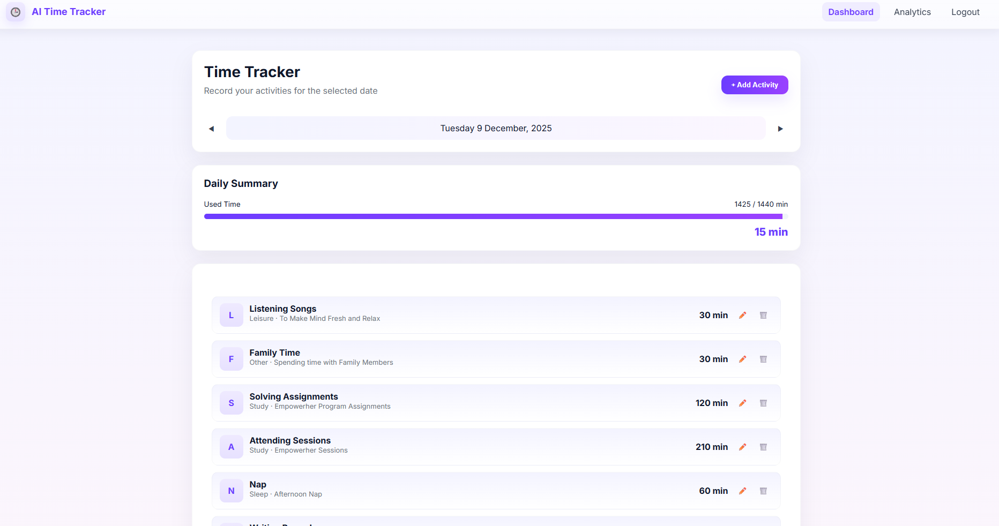

# 🕒 AI-Powered Time Tracking Web Application

A clean and simple web application that helps users log their daily activities, track how their 24 hours are spent, and visualize the breakdown using analytics.  
Built using **HTML/CSS/JavaScript**, **Firebase Authentication**, and **Firebase Realtime Database**.

---

## 🚀 Live Demo  
🔗 **Deployed Link:** *Add your GitHub Pages link here*

---

## 📹 Video Walkthrough  
🔗 **Video Link:** *Add your YouTube / Google Drive link here*

### Your video should include:
- Walkthrough of the main features  
- Show the dashboard with activities  
- Show the “No data available” state  
- Briefly explain how AI tools helped you during development  

---

## 🧰 Tech Stack

  
  
  
  
  
  

### Frontend
- HTML  
- CSS  
- JavaScript  
- DOM Manipulation  

### Backend / Database
- Firebase Authentication  
- Firebase Realtime Database  

### Deployment
- GitHub Pages  

---

## ⭐ Features

### ✔ User Authentication  
- Users can sign up and log in securely using Firebase Auth.

### ✔ Add & Track Daily Activities  
Each activity includes:  
- Activity Name  
- Category  
- Duration in minutes  

### ✔ 24-Hour Validation  
- Users must complete **exactly 1440 minutes** for a day (24 hours).

### ✔ Dashboard  
Shows:
- All activities logged for the day  
- Total hours spent  
- Time spent per category  
- Number of activities  

### ✔ Analytics Page  
- Pie Chart displaying time distribution  
- “No Data Available” fallback view  
- Previous/Next date navigation  

### ✔ Responsive UI  
- Modern, clean, professional layout inspired by Mocha UI  

---

### 🧪 How to Run Locally
1️⃣ Clone the repository
git clone https://github.com/jallurividya/ai-evaluation.git
cd ai-evaluation/AI-Evaluation

2️⃣ Add Firebase configuration

Inside firebase.js, replace with your Firebase config.

3️⃣ Host locally

Use Live Server (VS Code)

4️⃣ Deploy to GitHub Pages

Push code

Go to Settings → Pages

Select branch: main

Folder: /root

Save

Done! Your site will be live in seconds.

### 📸 Screenshots

### 🚀 Future Improvements

- Dark mode

- Weekly & monthly reports

- Export to PDF

- Drag-and-drop activity sorting

- AI-powered productivity suggestions

### 🙌 Acknowledgment

This project was built with the help of AI tools (ChatGPT) for:

- UI design

- Code generation

- Bug fixing

- Optimization

- Documentation (this README)
